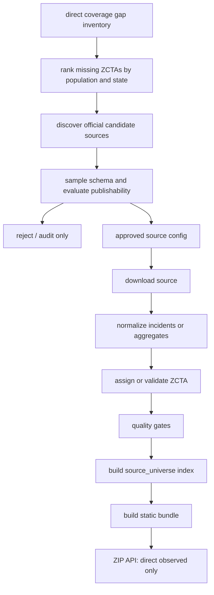

# Granular ZCTA Ingestion Pipeline

This plan grows ZIP/ZCTA coverage without publishing county-level, citywide, agencywide, state, or national fallback estimates as ZIP facts.

## Current Gap

Generate the current gap report with:

```bash
python scripts/report_direct_coverage_gaps.py --year 2024 --target-output data/processed/direct_zcta_targets_2024_minpop_50000.csv
```

Current 2024 exports show:

- 33,772 total rows in the old national modeled universe.
- 33,174 populated ZCTA rows.
- 1,265 direct observed ZCTAs in the public API.
- 32,507 missing rows if zero-population rows are counted.
- 31,909 missing populated ZCTAs.
- 39,061,851 people covered by direct observed ZCTA data.
- 299,010,009 people not yet covered by direct observed ZCTA data.
- 11.6% population coverage.
- 1,051 ZCTAs have at least 50,000 residents.
- 234 of those high-population ZCTAs are covered.
- 817 high-population ZCTAs are still missing.

Largest state gaps by missing population:

| State | Missing ZCTAs | Missing Population | Population Coverage |
| --- | ---: | ---: | ---: |
| CA | 1,498 | 29,598,197 | 24.7% |
| TX | 1,827 | 26,883,543 | 10.9% |
| FL | 995 | 22,415,950 | 0.0% |
| PA | 1,759 | 11,342,804 | 12.9% |
| OH | 1,177 | 11,118,424 | 5.9% |
| GA | 734 | 10,940,417 | 0.0% |
| NY | 1,554 | 10,372,410 | 47.5% |
| NC | 803 | 9,468,271 | 11.8% |
| IL | 1,311 | 9,388,279 | 26.0% |
| NJ | 595 | 9,343,809 | 0.0% |
| MI | 948 | 9,097,189 | 9.7% |

## Publication Standard

A ZIP/ZCTA API record is publishable only when the source can support a ZIP/ZCTA-level claim.

Publishable:

1. Incident-level records with usable latitude/longitude, assigned by point-in-ZCTA.
2. Incident-level records with an official incident ZIP/ZCTA field, when coordinates are missing or invalid.
3. Official aggregate records already reported by ZIP or ZCTA.
4. Official sub-ZCTA or near-ZCTA polygons, such as blocks, block groups, tracts, beats, or precincts, only when a geometry overlay passes strict coverage checks.

Not publishable as ZIP/ZCTA records:

1. County aggregate data.
2. Citywide or agencywide aggregate data that spans multiple ZCTAs.
3. State, metro, national, or modeled estimates.
4. Any source where the only path to a ZIP number is a population allocation from a larger geography.

Citywide or agencywide sources can be kept for separate city/agency products, audit checks, and source prioritization. They must not be relabeled as ZIP/ZCTA facts.

## Source Tiers

Tier A: Direct Incident Geometry

- Required fields: incident id, date/year, offense description/code, latitude, longitude.
- Output: normal `source_universe` incident pipeline.
- Runtime status: `coverage_status = observed`, `observed_level = zcta`.
- Confidence: highest, subject to coordinate completeness and source quality.

Tier B: Direct Incident ZIP/ZCTA

- Required fields: incident id, date/year, offense description/code, incident ZIP/ZCTA.
- Output: normal incident pipeline through `zip_fallback`.
- Runtime status: `coverage_status = observed`, `observed_level = zcta`.
- Confidence: medium unless source documents high-quality ZIP assignment.

Tier C: Official ZIP/ZCTA Aggregate

- Required fields: year, ZIP/ZCTA, offense counts, source documentation.
- Needed implementation: aggregate ingester that writes directly to `zcta_crime_annual` with lineage.
- Runtime status: `coverage_status = observed`, `observed_level = zcta`.

Tier D: Official Sub-ZCTA Polygon Aggregate

- Required fields: year, source geography id, geometry, offense counts, source documentation.
- Needed implementation: polygon overlay ingester.
- Publish only if the source units are smaller than or comparable to ZCTAs and the overlay has enough coverage.
- Suggested gates:
  - At least 90% of the target ZCTA population or land area is covered by source polygons.
  - No source polygon larger than a county is accepted.
  - No citywide, agencywide, countywide, or statewide polygon is accepted.
  - Every published ZCTA stores `observed_level = source_polygon` and `allocation_method = source_polygon_to_zcta_overlay`.

Tier X: Audit Only

- FBI CDE, NACJD NIBRS extract files, citywide reports, agency totals, county totals, and state/national estimates.
- Use these to discover agencies, compare totals, identify missing jurisdictions, and sanity-check source completeness.
- Do not publish these as ZIP/ZCTA API records.

## Pipeline



### 1. Build A Gap Inventory

Inputs:

- `data/exports/zcta_crime_scores_YYYY_national_modeled_baseline.csv` for the old full universe.
- `data/exports/zcta_crime_scores_YYYY.csv` for direct observed ZCTA coverage.
- `zip_county_mapping` only for state/county labels and prioritization, never for ZIP-level crime values.

Outputs:

- Missing populated ZCTAs.
- Missing population by state.
- Optional missing population by county/city from the consuming app location graph.
- A target queue ranked by missing population and likely data availability.

Use `scripts/report_direct_coverage_gaps.py` for the repo-local state gap report.
Use `--target-output` to write the complete missing high-population ZCTA queue for source discovery.

### 2. Discover Official Candidate Sources

Search only official publisher domains and machine-readable catalogs first:

- Socrata Discovery API and SODA endpoints.
- ArcGIS Hub / FeatureServer / MapServer metadata and query endpoints.
- CKAN/Data.gov package search and resource metadata.
- Known city, county, state, and police department open-data portals.
- FBI CDE agency and NIBRS participation data as an audit and prioritization seed.

Candidate keywords:

- `crime incident`
- `police incident`
- `NIBRS`
- `offense`
- `RMS`
- `calls for service` only when records are confirmed to be reportable offenses, not dispatch-only events.

Candidate metadata to store:

- `source_name`
- `publisher`
- `publisher_type`
- `homepage_url`
- `api_url`
- `download_type`
- `license`
- `update_cadence`
- `available_years`
- `source_geography`
- `has_coordinates`
- `has_zip`
- `has_zcta`
- `has_source_geometry`
- `date_fields`
- `offense_fields`
- `id_fields`
- `sample_row_count`
- `publishability_tier`
- `rejection_reason`

### 3. Evaluate Publishability

For each candidate, download metadata and a small sample before adding it to `config/sources.yaml`.

Automatic acceptance signals:

- Official government or law enforcement publisher.
- Public license or clear public-data terms.
- Machine-readable full-year data.
- Incident id or stable row id.
- Date/year field.
- Offense description or NIBRS/UCR code.
- Coordinates, incident ZIP/ZCTA, or a source geometry that can be evaluated.

Automatic rejection signals for ZIP/ZCTA publication:

- County is the smallest geography.
- City or agency is the smallest geography and spans more than one ZCTA.
- Only state or national estimates are available.
- Records are dispatch calls with no offense outcome.
- Location is intentionally suppressed beyond ZIP/ZCTA usability.
- No stable year/date field.

### 4. Promote Approved Sources

Approved Tier A/B sources become normal `config/sources.yaml` entries using existing adapters:

- `socrata_csv`
- `arcgis_query`
- `ckan_datastore`
- `direct`

Promoted source configs must include:

- `coverage_level`
- `coverage_area_name`
- `coverage_state`
- `coverage_notes`
- date fields
- offense fields
- coordinate or ZIP fields
- source URL
- exclusion filters for unfounded, non-criminal, or administrative rows

Tier C and Tier D require new source types before promotion:

- `zcta_aggregate_csv`
- `zcta_aggregate_socrata`
- `source_polygon_aggregate_arcgis`
- `source_polygon_aggregate_geojson`

### 5. Ingest And Normalize

Tier A/B path:

```bash
python -m crime_index.cli download-sources
python -m crime_index.cli ingest-crime --config config/sources.yaml
python -m crime_index.cli normalize-crime
python -m crime_index.cli assign-zctas
python -m crime_index.cli aggregate --year 2024
python -m crime_index.cli build-index --year 2024 --scope source_universe
python -m crime_index.cli build-static-bundle --year 2024
```

Iterative Tier A/B path for one newly promoted source:

```bash
python -m crime_index.cli download-sources --source SOURCE_NAME
python -m crime_index.cli ingest-crime --source SOURCE_NAME
python -m crime_index.cli normalize-crime
python -m crime_index.cli assign-zctas
python -m crime_index.cli aggregate --year 2024
python -m crime_index.cli build-index --year 2024 --scope source_universe
python -m crime_index.cli export --year 2024
python -m crime_index.cli build-static-bundle --year 2024
python scripts/report_direct_coverage_gaps.py --year 2024 --target-output data/processed/direct_zcta_targets_2024_minpop_50000.csv
```

Tier C path to add:

1. Download official ZIP/ZCTA aggregate file.
2. Normalize ZIP/ZCTA, year, population if present, and offense counts.
3. Map local offense buckets to project offense groups.
4. Insert directly into `zcta_crime_annual` or a dedicated aggregate staging table.
5. Build `source_universe` with lineage showing aggregate source origin.

Tier D path to add:

1. Download official source polygons and counts.
2. Reproject source and ZCTA geometries to an equal-area CRS.
3. Intersect source polygons with ZCTAs.
4. Allocate counts only where coverage gates pass.
5. Store overlap lineage and QA metrics per ZCTA.
6. Publish only with explicit `observed_level` and `allocation_method`.

### 6. Quality Gates

A source cannot increase public ZIP/ZCTA coverage until it passes:

- Year completeness: source covers the requested year or clearly documents partial-year status.
- Location completeness: enough rows can be assigned to ZCTAs.
- State bounds: coordinates fall inside expected state bounds.
- Deduplication: incident ids or stable fallback ids are not over-counting duplicates.
- Offense mapping: violent/property/drug/public-order/weapons/other classification rate is acceptable.
- Exclusion policy: unfounded, administrative, and non-criminal rows are filtered.
- Lineage: every published ZCTA can name the source and assignment method.
- No larger-geography leakage: county/city/agency/state rows cannot appear in `data/server/api/v1/YYYY/zips`.

### 7. Publish

The public bundle must continue to publish only `source_universe`:

```bash
python -m crime_index.cli build-static-bundle --year 2024
```

Expected manifest contract:

```json
{
  "runtime_data_policy": {
    "published_scope": "source_universe",
    "fallbacks": "disabled"
  }
}
```

Missing ZIPs stay missing. Group analysis may aggregate found ZIPs and report `missing_zips`, but it must not synthesize data for the missing members.

## Build Order

1. Keep the persistent `source_candidates` and `source_evaluations` tables populated with every official source considered.
2. Add `discover-sources` CLI for Socrata, ArcGIS, CKAN, and Data.gov metadata.
3. Add `evaluate-source` CLI that samples schemas and assigns a publishability tier.
4. Add `promote-source` CLI that writes approved Tier A/B sources to `config/sources.yaml`.
5. Add Tier C aggregate ingestion.
6. Add Tier D polygon aggregate ingestion with overlay lineage.
7. Keep `make coverage-gaps` in the release checklist and fail release builds when the configured high-population target is not met.
8. Iterate by state gap priority, starting with CA, TX, FL, PA, OH, GA, NY, MI, NC, and IL.

## Notes From Source Research

- FBI CDE and NACJD NIBRS are valuable audit sources, but they should not be used as ZIP/ZCTA fallback data. Public extract metadata identifies city as the smallest geography for NACJD NIBRS extract files.
- Local official open-data feeds can have exactly what this project needs. San Diego's NIBRS offense dataset documents block address, ZIP, latitude, and longitude fields; Detroit's 2024 RMS crime incident layer includes offense, ZIP, longitude, and latitude fields.
- The existing repo already supports the three most common machine-readable publishing paths: Socrata/SODA, ArcGIS query, and CKAN datastore. The next leverage point is source discovery, evaluation, and promotion automation.
